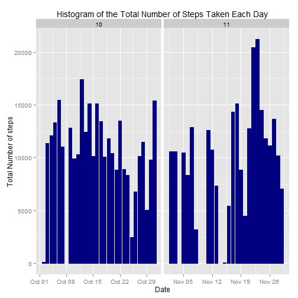
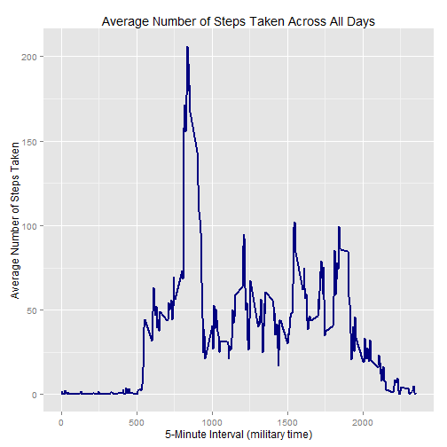
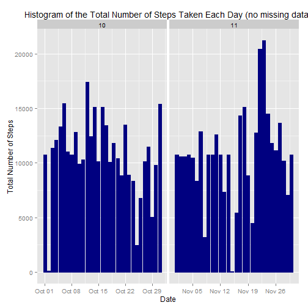

## Initial Settings

```r
# Show code 
echo = TRUE

# Don't Show Scientific Number Formatting
options(scipen = 1)
```

## Loading and preprocessing the data

```r
# Extract the csv data file
unzip("activity.zip")

filename <- "activity.csv"
data <- read.csv(filename, colClasses = c("integer", "Date", "factor"))

# Convert date to date data type
data$month <- as.numeric(format(data$date, "%m"))
omitNA <- na.omit(data)
rownames(omitNA) <- 1:nrow(omitNA)
head(omitNA)
```

```
##   steps       date interval month
## 1     0 2012-10-02        0    10
## 2     0 2012-10-02        5    10
## 3     0 2012-10-02       10    10
## 4     0 2012-10-02       15    10
## 5     0 2012-10-02       20    10
## 6     0 2012-10-02       25    10
```

```r
dim(omitNA)
```

```
## [1] 15264     4
```

```r
# Load plotting library
library(ggplot2)
```

## What is mean total number of steps taken per day?
For this part of the assignment, you can ignore the missing values in the dataset.

### 1. Calculate the total number of steps taken per day

```r
totalDailySteps <- aggregate(omitNA$steps, list(Date = omitNA$date), FUN = "sum")$x
```

###2. Make a histogram of the total number of steps taken each day

```r
ggplot(omitNA, aes(date, steps)) + geom_bar(stat = "identity", colour = "navy", fill = "navy", width = 0.8) + facet_grid(. ~ month, scales = "free") + labs(title = "Histogram of the Total Number of Steps Taken Each Day", x = "Date", y = "Total Number of steps")
```

 


###3. Calculate and report the mean and median of the total number of steps taken per day
Mean of the total number of steps taken per day:

```r
mean(totalDailySteps)
```

```
## [1] 10766.19
```
Median of the total number of steps taken per day:

```r
median(totalDailySteps)
```

```
## [1] 10765
```

## What is the average daily activity pattern?

###1. Make a time series plot (i.e. type = "l") of the 5-minute interval (x-axis) and the average number of steps taken, averaged across all days (y-axis)

```r
averageSteps <- aggregate(omitNA$steps, list(interval = as.numeric(as.character(omitNA$interval))), FUN = "mean")
names(averageSteps)[2] <- "meanOfSteps"

ggplot(averageSteps, aes(interval, meanOfSteps)) + geom_line(color = "navy", size = 0.8) + labs(title = "Average Number of Steps Taken Across All Days", x = "5-Minute Interval (military time)", y = "Average Number of Steps Taken")
```

 

### 2.Which 5-minute interval, on average across all the days in the dataset, contains the maximum number of steps?

```r
averageSteps[averageSteps$meanOfSteps == max(averageSteps$meanOfSteps), ]
```

```
##     interval meanOfSteps
## 104      835    206.1698
```

## Imputing missing values
Note that there are a number of days/intervals where there are missing values (coded as NA). The presence of missing days may introduce bias into some calculations or summaries of the data.

###1. Calculate and report the total number of missing values in the dataset (i.e. the total number of rows with NAs)


```r
sum(is.na(data))
```

```
## [1] 2304
```


###2. Devise a strategy for filling in all of the missing values in the dataset. The strategy does not need to be sophisticated. For example, you could use the mean/median for that day, or the mean for that 5-minute interval, etc.

My strategy will be based on the means for the 5-minute intervals to fill for the missing values.

###3. Create a new dataset that is equal to the original dataset but with the missing data filled in.


```r
newDataset <- data 
for (i in 1:nrow(newDataset)) {
    if (is.na(newDataset$steps[i])) {
        newDataset$steps[i] <- averageSteps[which(newDataset$interval[i] == averageSteps$interval), ]$meanOfSteps
    }
}

head(newDataset)
```

```
##       steps       date interval month
## 1 1.7169811 2012-10-01        0    10
## 2 0.3396226 2012-10-01        5    10
## 3 0.1320755 2012-10-01       10    10
## 4 0.1509434 2012-10-01       15    10
## 5 0.0754717 2012-10-01       20    10
## 6 2.0943396 2012-10-01       25    10
```

```r
sum(is.na(newDataset))
```

```
## [1] 0
```

###4. Make a histogram of the total number of steps taken each day and Calculate and report the mean and median total number of steps taken per day. Do these values differ from the estimates from the first part of the assignment? What is the impact of imputing missing data on the estimates of the total daily number of steps?


```r
ggplot(newDataset, aes(date, steps)) + geom_bar(stat = "identity",
                                             colour = "navy",
                                             fill = "navy",
                                             width = 0.8) + facet_grid(. ~ month, scales = "free") + labs(title = "Histogram of the Total Number of Steps Taken Each Day (no missing data)", x = "Date", y = "Total Number of Steps")
```

 

Mean total number of steps taken per day:

```r
newTotalSteps <- aggregate(newDataset$steps, list(Date = newDataset$date), FUN = "sum")$x
newMean <- mean(newTotalSteps)
newMean
```

```
## [1] 10766.19
```
Median total number of steps taken per day:

```r
newMedian <- median(newTotalSteps)
newMedian
```

```
## [1] 10766.19
```
Compare them with the two before imputing missing data:

```r
oldMean <- mean(totalDailySteps)
oldMedian <- median(totalDailySteps)
newMean - oldMean
```

```
## [1] 0
```

```r
newMedian - oldMedian
```

```
## [1] 1.188679
```
After imputing the missing data, both of the old and the new mean of total steps taken per day are equal. Whereas,the new median of total steps taken per day is greater than the old median.


##Are there differences in activity patterns between weekdays and weekends?

###1. Create a new factor variable in the dataset with two levels - "weekday" and "weekend" indicating whether a given date is a weekday or weekend day.


```r
head(newDataset)
```

```
##       steps       date interval month
## 1 1.7169811 2012-10-01        0    10
## 2 0.3396226 2012-10-01        5    10
## 3 0.1320755 2012-10-01       10    10
## 4 0.1509434 2012-10-01       15    10
## 5 0.0754717 2012-10-01       20    10
## 6 2.0943396 2012-10-01       25    10
```

```r
newDataset$weekdays <- factor(format(newDataset$date, "%A"))
levels(newDataset$weekdays)
```

```
## [1] "Friday"    "Monday"    "Saturday"  "Sunday"    "Thursday"  "Tuesday"  
## [7] "Wednesday"
```

```r
levels(newDataset$weekdays) <- list(weekday = c("Monday", "Tuesday",
                                             "Wednesday", 
                                             "Thursday", "Friday"),
                                 weekend = c("Saturday", "Sunday"))
levels(newDataset$weekdays)
```

```
## [1] "weekday" "weekend"
```

```r
table(newDataset$weekdays)
```

```
## 
## weekday weekend 
##   12960    4608
```


###2. Make a panel plot containing a time series plot (i.e. type = "l") of the 5-minute interval (x-axis) and the average number of steps taken, averaged across all weekday days or weekend days (y-axis). See the README file in the GitHub repository to see an example of what this plot should look like using simulated data.


```r
averageSteps <- aggregate(newDataset$steps, 
                      list(interval = as.numeric(as.character(newDataset$interval)), 
                           weekdays = newDataset$weekdays),
                      FUN = "mean")
names(averageSteps)[3] <- "meanOfSteps"
library(lattice)
xyplot(averageSteps$meanOfSteps ~ averageSteps$interval | averageSteps$weekdays, 
       layout = c(1, 2), type = "l", 
       xlab = "Interval", ylab = "Number of Steps")
```

 
